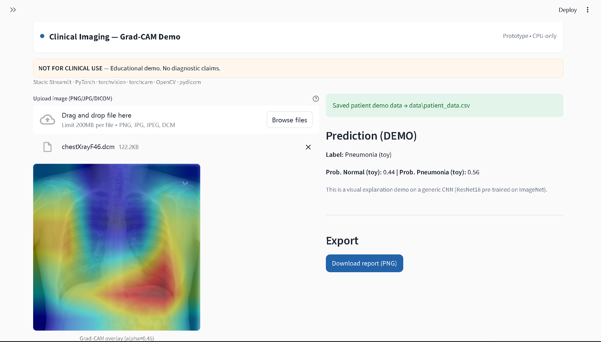
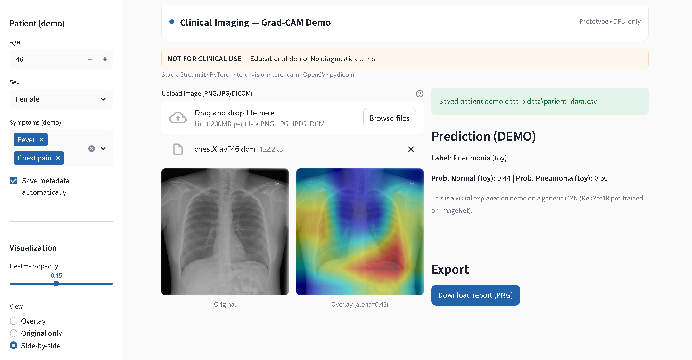

# Clinical Imaging v0.1 — Grad-CAM Demo (NOT FOR CLINICAL USE)

[]

**What:**  
Upload a chest image (PNG, JPG, DICOM) → see a toy prediction + a Grad-CAM heatmap overlay showing where the model “looked”.

**Why (for recruiters):**  
Demonstrates ability to:
- Handle **DICOM medical images** via `pydicom`
- Run **PyTorch CNN inference** on CPU
- Generate **explainable AI visualizations** with Grad-CAM
- Build a **clean, reproducible UI** for healthcare using Streamlit
- Save patient demo metadata (CSV/SQLite-ready)
- Package and deploy on Hugging Face Spaces (no install required)

⚠ **Disclaimer:** Educational demo only — not a medical device. No diagnostic use.

## Preview
- **Grad-CAM Overlay on Chest DICOM** 
  

- **Patient Metadata & Controls (Sidebar)** 
  

---

## Quick start

- **Online demo:** TBD (Hugging Face Spaces link)
- **GitHub repo:** [Clinical AI v0.1](https://github.com/MattiaLongo06/clinical-ai-v0.)

---

## Run locally
conda create -n clinical-ai-v0_1 python=3.11 -y
conda activate clinical-ai-v0_1
pip install -r requirements.txt
streamlit run app.py

---

## Features

- **DICOM support** load .dcm files via pydicom with basic windowing.
- **Pretrained CNN inference** (ResNet18, ImageNet weights, CPU-friendly).
- **Optional patient metadata** (age, sex, symptoms) saved to CSV.
- **Export overlay as PNG** for sharing or documentation.
- **Clean, medical-style UI** with custom Streamlit theme.

---

## Limitations

- **Toy prediction** only (brightness-based) — not for clinical use.
- **No diagnostic claims.**
- **Educational and portfolio purposes only.**

---

## Tech Stack

- **Frontend/UI:** Streamlit (custom CSS theme)
- **Model:** PyTorch + torchvision (ResNet18)
- **Explainability:** torchcam (Grad-CAM)
- **Medical imaging:** pydicom
- **Image processing:** Pillow, OpenCV
- **Data storage:** CSV via pandas

---

## Roadmap

- **v0.2:** Fine-tuned chest X-ray CNN, Docker deploy.
- **v0.3:** Segmentation (U-Net) + FHIR API integration.
- **v0.4:** MLflow tracking, calibration, and external validation.

---

## Author

Developed by **Mattia Lorenzo Longo** as part of a long-term Clinical AI Engineer career plan.
